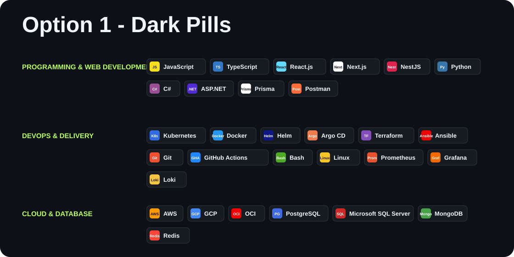
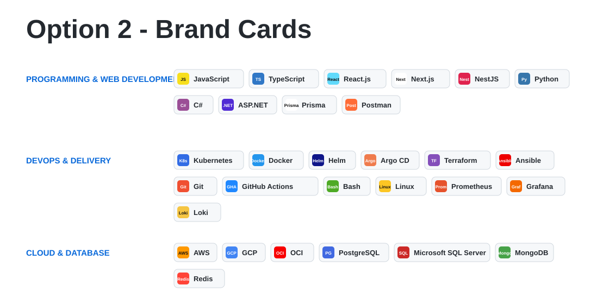
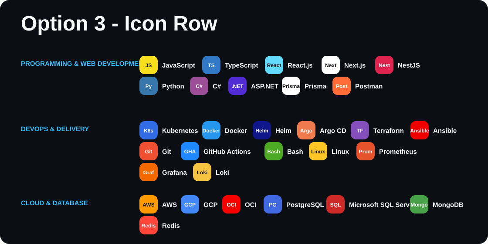
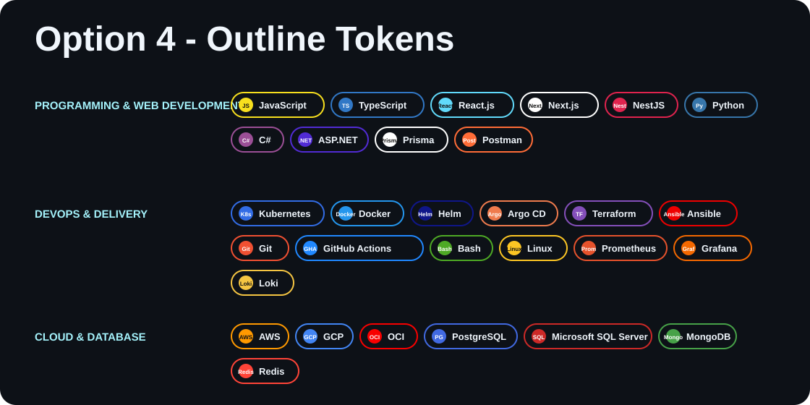
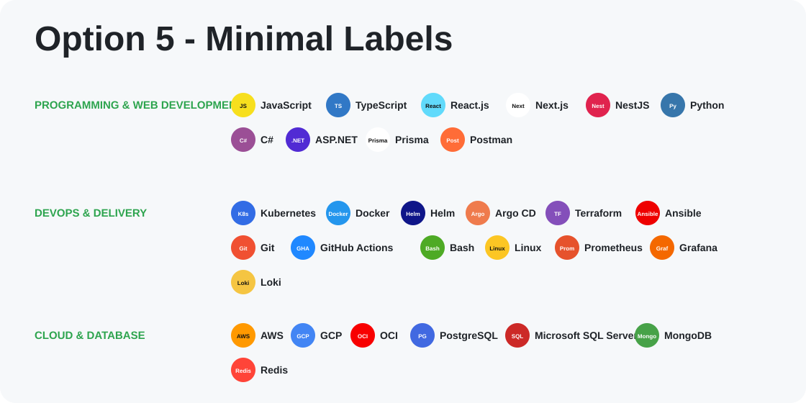

# Hi, I'm Bader

I build full-stack web platforms with DevOps as part of the engineering process, combining clean application architecture, automated CI/CD, infrastructure-as-code, containerized environments, and observability.

I care about turning ideas into systems that are practical to use, easy to run, and clear for other developers to understand. My work focuses on the space where product engineering, backend systems, and cloud operations meet.

## Tech Stack Options

Each option below is a single SVG image. That keeps the layout stable for public GitHub visitors, incognito windows, mobile, and different browser widths.

### Option 1 - Dark Pills

### Option 2 - Brand Cards

### Option 3 - Icon Row

### Option 4 - Outline Tokens

### Option 5 - Minimal Labels

